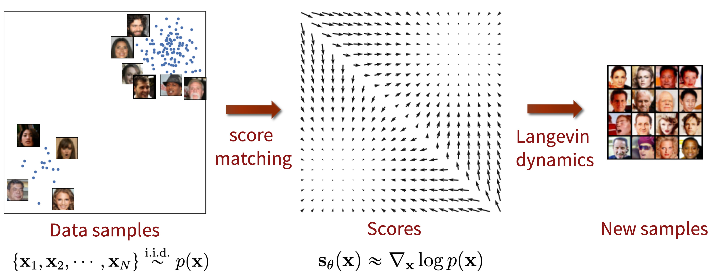

# Score-Based Generative Modeling on MNIST

Welcome to the **Score-Based Generative Modeling on MNIST** project! This repository showcases the application of score-based generative models to the MNIST dataset using two innovative approaches:
- **Multiple Noise Perturbation**
- **Stochastic Differential Equation (SDE) Approach**

Both techniques have been used to generate hand-written digit images of Number 3, and detailed video demonstrations are provided for each method.

## Overview

Score-based generative models have demonstrated remarkable capabilities in synthesizing high-quality images. This project leverages the MNIST dataset to showcase two approaches:

1. **Multiple Noise Perturbation**: This methodology involves the application of varied noise levels to the dataset. During training, the model learns the intricate score functions at different noise scales, facilitating a robust denoising process during sampling.
   
2. **SDE Approach**: This technique formulates the image generation process as a continuous reverse-time stochastic differential equation. The framework allows for a smooth and refined transition from noise to image, resulting in high-fidelity outputs.

Each of these approaches is accompanied by a video demonstration that illustrates the full image generation journey—from initial noise to recognizable digits.

---

## Video Demonstrations

### Multiple Noise Perturbation (MNP) Approach

<video width="640" height="360" controls>
  <source src="./assets/MNP.mp4" type="video/mp4">
  Your browser does not support the video tag.
</video>

### SDE Approach

<video width="640" height="360" controls>
  <source src="./assets/SDE.mp4" type="video/mp4">
  Your browser does not support the video tag.
</video>
